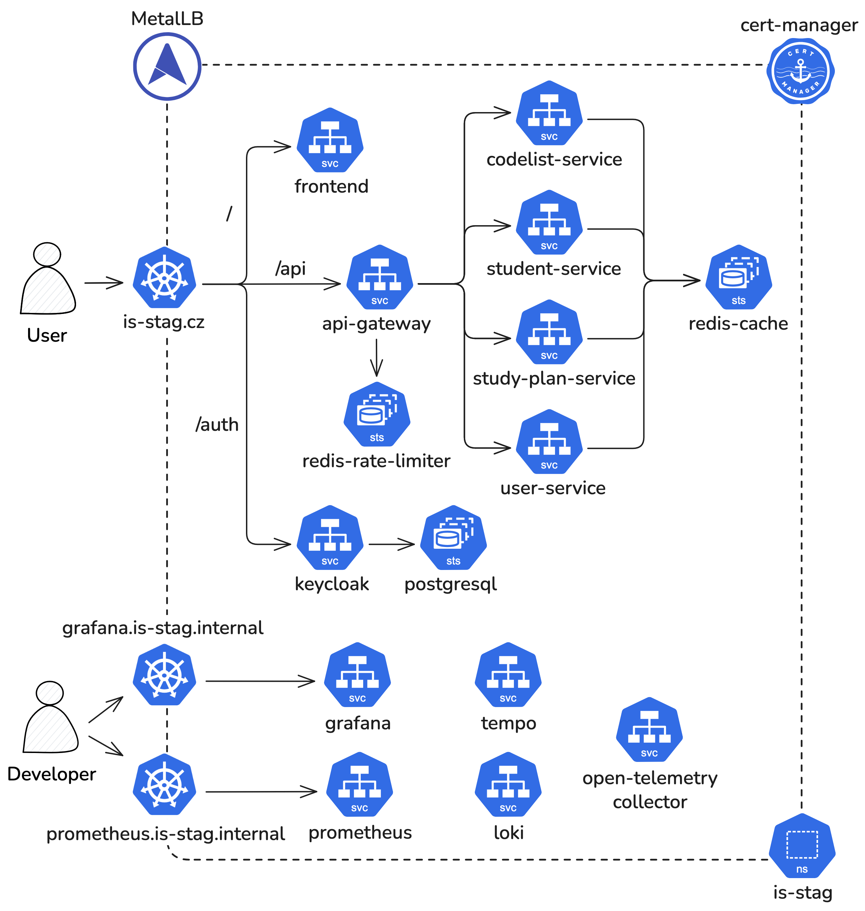

# Reference Cloud Architecture for IS/STAG

[](https://artifacthub.io/packages/search?repo=is-stag)
[](https://github.com/JakubPavlicek/is-stag/actions/workflows/security-scan.yaml)

A modern, cloud-native reference architecture for a University Information System (IS/STAG).
This project demonstrates a scalable microservices architecture using Spring Boot, React, and Kubernetes, complete with
full observability.

---

## 🏗 System Architecture

The system is designed as a set of microservices communicating via gRPC, deployed on Kubernetes.


### 🛠 Tech Stack

**Infrastructure & DevOps**

* **Kubernetes** (K8s) – Container Orchestration
* **Helm & Helmfile** – Package Management & Deployment
* **Docker Compose** – Local Development
* **Nginx Gateway Fabric** – Kubernetes Gateway API
* **Cert-Manager** – TLS Certificate Management
* **GitHub Actions** – CI/CD Pipelines

**Backend ([/services](./services))**

* **Java 25** & **Spring Boot 4.0.1**
* **Spring Cloud 2025.1.0** (Gateway, Circuit Breaker)
* **gRPC** – Inter-service communication
* **Oracle Database** – Primary Data Store
* **Redis** – Caching & Rate Limiting

**Frontend ([/client](./client))**

* **React 19** & **Vite**
* **TypeScript**
* **Shadcn UI** & **Tailwind CSS**
* **TanStack Router** & **TanStack Query** & **TanStack Form**

**Observability**

* **OpenTelemetry** - Tracing, Metrics, Logs
* **Grafana** - Visualization
* **Prometheus** - Metrics
* **Loki** - Logs
* **Tempo** - Distributed Tracing

---

## ☸️ Kubernetes Architecture



---

## 🚀 Getting Started

### Prerequisites

* [Docker Desktop](https://www.docker.com/products/docker-desktop/) (with Kubernetes enabled for local K8s)
* [Java 25 SDK](https://jdk.java.net/25/)
* [Node.js 22+](https://nodejs.org/)
* [Helm](https://helm.sh/) & [Helmfile](https://github.com/helmfile/helmfile) (for K8s deployment)

### ⚡️ Quick Start (Docker Compose)

The fastest way to spin up the entire stack locally is using Docker Compose.

1. **Clone the repository**
    ```shell
    git clone https://github.com/JakubPavlicek/is-stag.git
    cd is-stag
    ```

2. **Download the OpenTelemetry Java Agent**

   Download the latest OpenTelemetry Java Agent JAR from the [releases page](https://github.com/open-telemetry/opentelemetry-java-instrumentation/releases) and put it into the `otel/` folder.
   So the result should look like `otel/opentelemetry-javaagent.jar`.


3. **Create a `.env` file in the root directory with the following variables**
   ```text
   SPRING_DATASOURCE_URL=<JDBC_CONNECTION_STRING>
   SPRING_DATASOURCE_USERNAME=<DB_USERNAME>
   SPRING_DATASOURCE_PASSWORD=<DB_PASSWORD>
   
   DATASOURCE_PROXY_USERNAME=<DB_PROXY_USERNAME>
   DATASOURCE_PROXY_PASSWORD=<DB_PROXY_PASSWORD>
   DATASOURCE_TARGET_USERNAME=<DB_TARGET_USERNAME>
   ```

4. **Start the stack**
    ```shell
    docker compose up -d
    ```

5. **Access the services**
    * **Frontend:** [http://localhost:5173](http://localhost:5173)
    * **API Gateway:** [http://localhost:8100](http://localhost:8100)
    * **Keycloak:** [http://localhost:8180/auth](http://localhost:8180/auth) (stagadmin/stagadmin)
    * **Grafana:** [http://localhost:3000](http://localhost:3000)

---

## ☸️ Kubernetes Deployment

This project uses **Helmfile** to manage deployments across environments.

The secrets are encrypted using **helm-secrets** plugin with [SOPS](https://github.com/mozilla/sops)
and [Age](https://github.com/FiloSottile/age) encryption.

> To automatically decrypt the secrets, set the `SOPS_AGE_KEY_FILE` environment variable before deploying the stack.
> The `SOPS_AGE_KEY_FILE` should point to the file containing your Age key.

### 1. Cluster Setup

Ensure you have a Kubernetes cluster running (e.g., Minikube).

```shell
# Start Minikube
minikube start
```

### 2. Deploy with Helmfile

Deploy the entire suite of applications and infrastructure:

```shell
# Enter the k8s directory
cd k8s

# Set the path to your age key file to decrypt secrets
SOPS_AGE_KEY_FILE=$HOME/.config/sops/age/keys.txt

# Apply the configuration
helmfile apply -e prod
```

### 3. Update the /etc/hosts file

After deployment, retrieve the external IP addresses of the services:

```shell
kubectl get svc
```

And add the following entries to your `/etc/hosts` file:

```text
<external-ip> is-stag.cz
<external-ip> grafana.is-stag.internal
<external-ip> prometheus.is-stag.internal
```

This will install:

* **Infrastructure:** MetalLB, Nginx Gateway Fabric, Cert-Manager, Keycloak, PostgreSQL and Redis.
* **Observability Stack:** OTEL, Prometheus, Grafana, Loki, Tempo.
* **Applications:** All microservices and the frontend.

---

## 📂 Repository Structure

```text
├── charts/                  # Local Helm charts for microservices
├── client/                  # React frontend application
├── k6/                      # Load testing scripts
├── k8s/                     # Kubernetes manifests & Helmfile configs
├── keycloak/                # Keycloak realm & authenticator configuration
├── obervability/            # Grafana dashboards & Obsersavility configs
├── proto/                   # gRPC proto files
├── services/                # Java/Spring Boot microservices
│   ├── api-gateway          # Spring Cloud Gateway
│   ├── codelist-service     # Shared dictionaries/enums
│   ├── student-service      # Student data management
│   ├── study-plan-service   # Study plans & curriculum
│   └── user-service         # User profiles & management
├── docker-compose.yaml      # Local development orchestration
└── README.md                # You are here
```

## 🔭 Observability

The system is fully instrumented for observability using OpenTelemetry Java Agent, providing insights into application
performance and behavior.

* **Traces:** Every request is traced using OpenTelemetry Java Agent and exported to Tempo.
* **Metrics:** Spring Boot services uses OpenTelemetry Java Agent to export metrics to Prometheus.
* **Logs:** Logs are collected via OpenTelemetry and sent to Loki.

## Development

This application is a Master's thesis (2025/26), authored by Jakub Pavlíček from the University of West Bohemia in
Pilsen – Faculty of Applied Sciences.