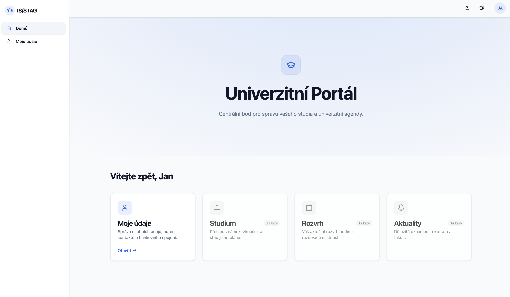
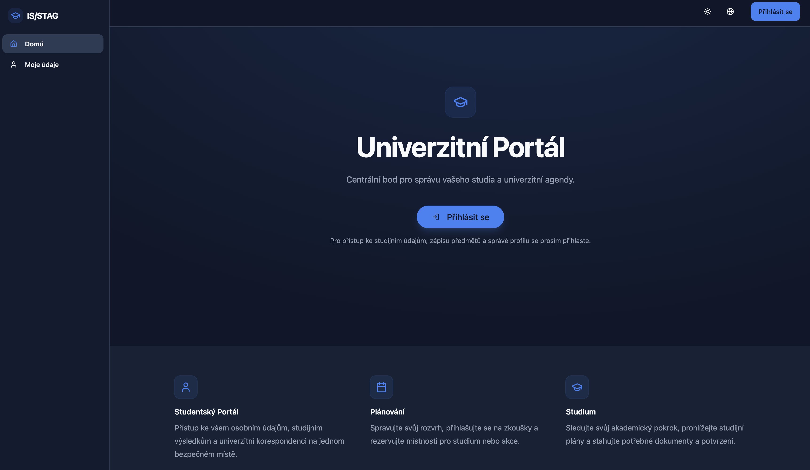
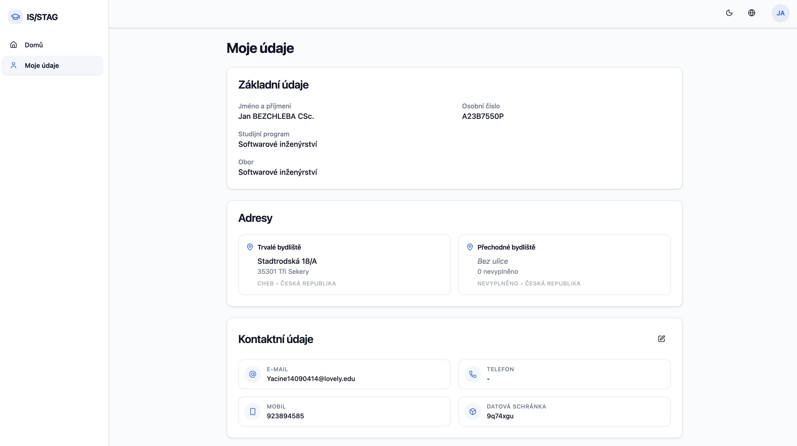
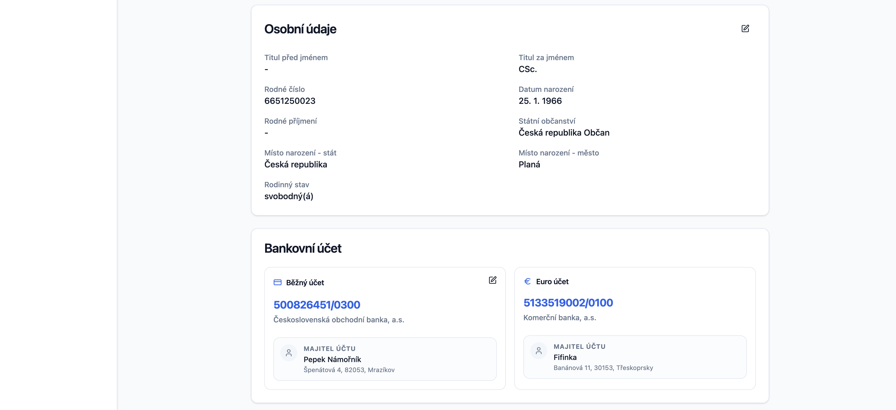
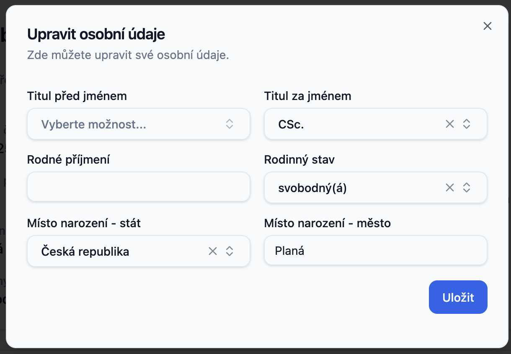

# React Client

[](https://codecov.io/github/JakubPavlicek/is-stag)
[](https://github.com/JakubPavlicek/is-stag/actions/workflows/frontend-ci.yaml)
[](https://react.dev/)
[](https://www.typescriptlang.org/)
[](https://vitejs.dev/)

The modern web interface for the IS/STAG University Portal. Built with performance and developer experience in mind,
leveraging the latest React ecosystem tools.

---

## ⚡️ Tech Stack

* **Core:** [React 19](https://react.dev/), [TypeScript](https://www.typescriptlang.org/)
* **Build Tool:** [Vite](https://vitejs.dev/)
* **Styling:** [Tailwind CSS](https://tailwindcss.com/), [Shadcn UI](https://ui.shadcn.com/)
* **Routing:** [TanStack Router](https://tanstack.com/router)
* **State/Data Fetching:** [TanStack Query](https://tanstack.com/query/latest)
* **Auth:** Keycloak Integration (OIDC)

---

## 🚀 Getting Started

### Prerequisites

* **Node.js**: v25.3.0 or higher
* **npm**: v11.7.0 or higher

### Installation

1. **Clone & Install**
   ```bash
   cd client
   npm install
   ```

### Development

Start the development server with Hot Module Replacement (HMR):

```bash
npm run dev
```

The application will be available at [http://localhost:5173](http://localhost:5173).

### Code Generation

We use OpenAPI to generate typed API clients from the backend specifications. If the backend API changes:

```bash
npm run gen:api
```

---

## 🏗 Project Structure

```text
src/
├── api/             # Generated API clients (do not edit manually)
├── components/      # Reusable UI building blocks
│   ├── features/    # Domain-specific components (e.g., StudentCard)
│   ├── layout/      # App shell (Sidebar, Header, Footer)
│   ├── theme/       # Theming components (Dark mode toggle, Color schemes)
│   └── ui/          # Low-level primitives (Shadcn UI: Button, Input)
├── hooks/           # Custom React hooks
├── lib/             # Utilities, Auth hooks, Axios config
├── routes/          # TanStack Router definitions
├── test/            # Testing setup
└── main.tsx         # App entry point
```

---

## Preview

### Home Screen (Logged In)


### Home Screen (Dark Mode / Logged Off)


### My Data Overview



### Personal Info Form

